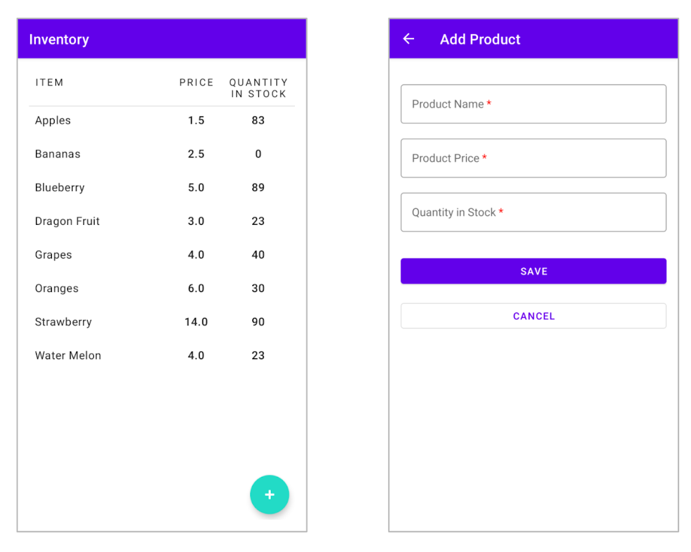

# Warmup_Week05_Day01 🔥
---
# Inventory App
## What you'll build
## You'll build an Inventory app that displays a list of inventory items. The app can add and delete items from the app database using Room.

## you will work with a starter app called Inventory app, and add the database layer to it using the Room library. The final version of the app displays a list items from the inventory database using a `RecyclerView`. The user will have options to add a new item, and delete an item from the inventory database.
## Below are screenshots from the final version of the app.

